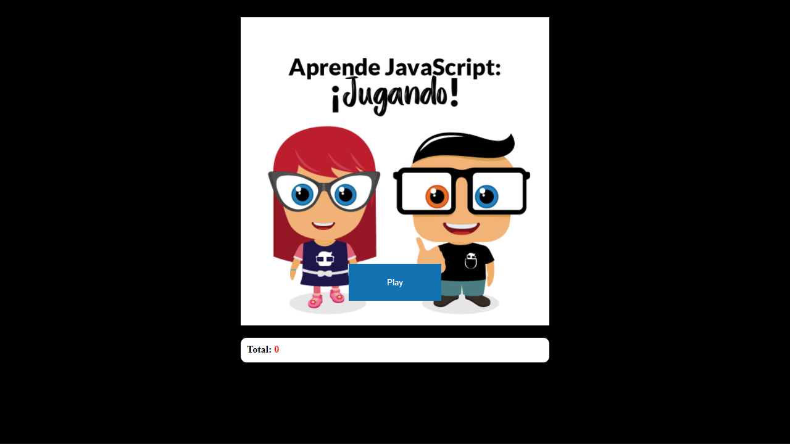
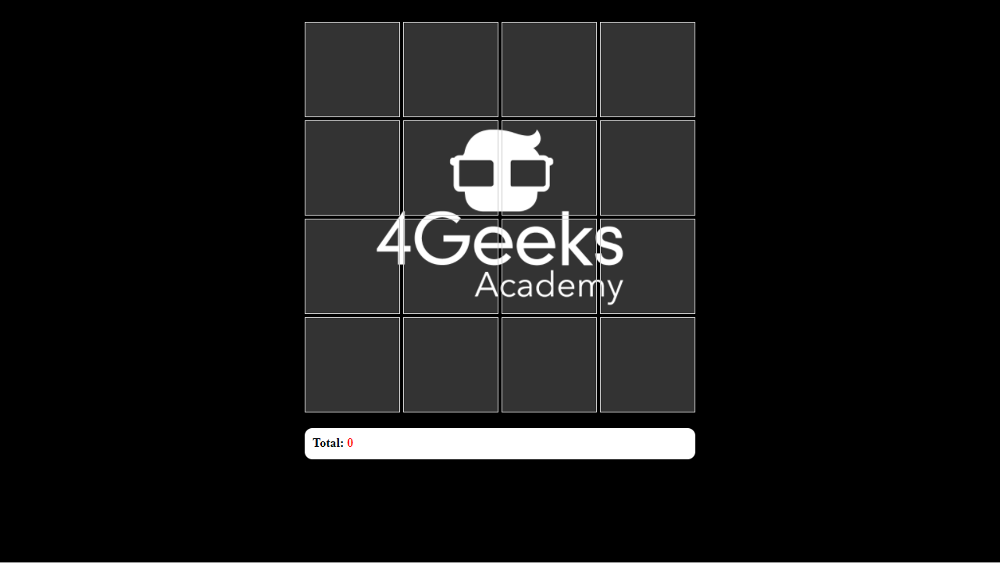

# Learn Javascript by Playing

### Main Agenda.

- What is Javascript
- Variables (let, const, var)
- Conditionals (if, else)
- Loops(for, while, etc.)
- Functions
- DOM (Document Object Model)
- Events and Listeners

### Initial Screen of Our Game

### Game screen where we will show our Images

### Images that we will be using in our game

| Rigoberto     |      Ada      | Laptop        | JavaScript     |
| ------------- | ------------- | ------------- | ------------- |
|   |   |   |   |

| @4GeeksAcademy | @4GeeksAcademyVE | @4GeeksAcademyCL | @4GeeksAcademyES |
| ------------- | ------------- | ------------- | ------------- |
|  |  |  |  |

